# MSPAN: Lightweight Image Super-Resolution with Multi-Semantic Guidance


<!-- # Contents
1. Introduction
2. Train
3. Test
4. Results
5. Citation
6. Acknowledgements -->

# Introduction
In  image super-resolution (SR), recovering images with high fidelity is a struggle for shallow convolutional neural networks (CNNs). Deepening or widening CNNs helps to improve the perceptual and numerical results to some extent, but the corresponding increase in computational complexity is unacceptable in practical applications. To address this issue, we propose a lightweight multi-semantic pixel attention network (MSPAN) to break the performance limitations of shallow networks. Specifically, by referring to sufficiently rich semantic information, the proposed multi-semantic pixel attention (MSPA) mechanism can outline more realistic textures with low computational cost.  Moreover, inspired by dense connection and information distillation, we construct an efficient information distillation dense block (IDDB) by stacking adjustment units (AUs) and correction units (CUs) alternately. The AU is responsible for receiving and nonlinearly fusing the features transmitted from the previous layers. Then, the fused features are  split into two parts: one part will flow to the later AUs to increase the information richness, while the other part will flow to the  CU for further refinement. Finally, with the addition of MSPA, the performance of IDDB achieves further breakthrough. In addition to SR, IDDB is able to maintain efficiency in other image restoration (IR) tasks, such as image denoising, image deraining, etc.   Extensive experiments on image SR with different degradation kernels and other IR tasks illustrate that our method is able to achieve better quantitative metrics and visual quality with a lower model complexity than other state-of-the-art models.


## Train
* Download [Training dataset DIV2K](https://drive.google.com/open?id=12hOYsMa8t1ErKj6PZA352icsx9mz1TwB)
* Convert png file to npy file
```bash
python scripts/png2npy.py --pathFrom /path/to/DIV2K/ --pathTo /path/to/DIV2K_decoded/
```
* Run training x2, x3, x4 model
```bash
python train.py --root /path/to/DIV2K_decoded/ --scale 2  
python train.py --root /path/to/DIV2K_decoded/ --scale 3 
python train.py --root /path/to/DIV2K_decoded/ --scale 4 
```


<!-- 

## Test

* Runing test:
```bash
# Set5 x2 
python test.py --test_hr_folder Test_Datasets/Set5/ --test_lr_folder Test_Datasets/Set5_LR/x2/ --output_folder results/Set5/x2 --checkpoint checkpoints/IMDN_x2.pth --upscale_factor 2
# RealSR IMDN_AS
python test_IMDN_AS.py --test_hr_folder Test_Datasets/RealSR/ValidationGT --test_lr_folder Test_Datasets/RealSR/ValidationLR/ --output_folder results/RealSR --checkpoint checkpoints/IMDN_AS.pth
``` -->


<!-- ## Results
[百度网盘](https://pan.baidu.com/s/1DY0Npete3WsIoFbjmgXQlw)提取码: 8yqj or
[Google drive](https://drive.google.com/open?id=1GsEcpIZ7uA97D89WOGa9sWTSl4choy_O)

The following PSNR/SSIMs are evaluated on Matlab R2017a and the code can be referred to [Evaluate_PSNR_SSIM.m](https://github.com/yulunzhang/RCAN/blob/master/RCAN_TestCode/Evaluate_PSNR_SSIM.m). -->

## Architectures
<p align="center">
    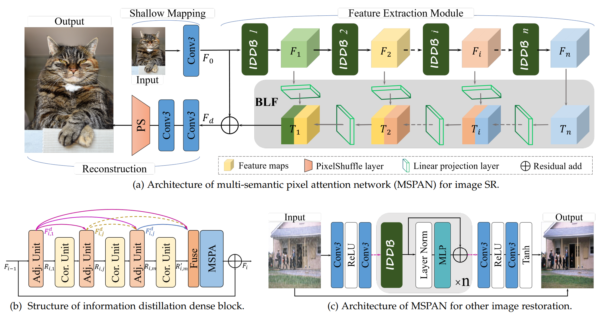 <br />
    <em> (a) Architecture of our proposed multi-semantic pixel attention network (MSPAN).  (b) Structure of  information distillation dense block. (c) Architecture of MSPAN  for other image restoration task. </em>
</p>

<!-- *Note: Using torch.cuda.Event() to record inference times.  -->


## Multi-semantic pixel attention (MSPA)  mechanism
<p align="center">
    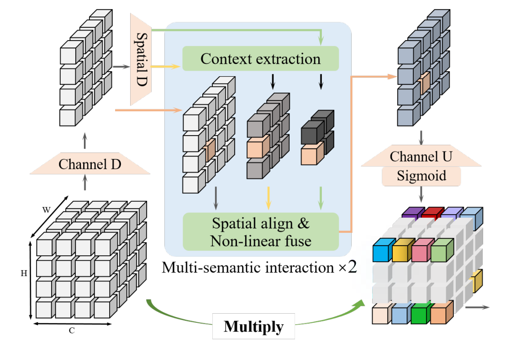 <br />
    <em> Overview of of multi-semantic pixel attention (MSPA)  mechanism. Here, we use multiple branches to generate contextual information containing different generalization capabilities. After sequentially fusing multiple semantic information, the final attention matrix will carry more textural clues.. </em>
</p>

## Feature visualization
<p align="center">
    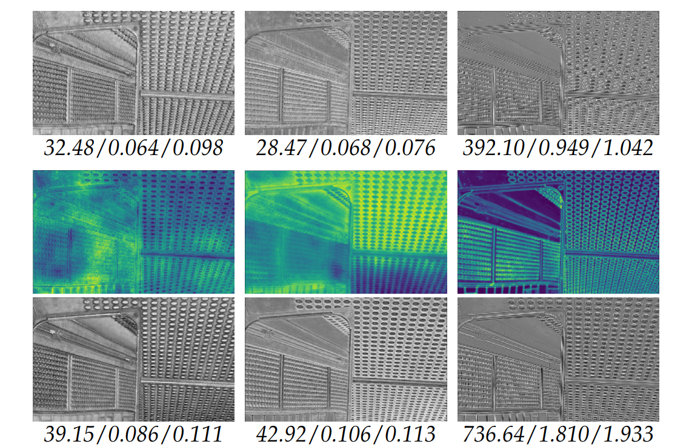 <br />
    <em>  The average feature maps of the input, attention matrix, and reweighted output in the 2nd, 4th, and 6th MSPA.
 We give the Tenengrad/standard deviation/mean values of the input and output features. The  visual and numerical results demonstrate the effectiveness of our MSPA to enhance textural details. </em>
</p>

## Reulsts on super-resolution (PSNR & SSIM)
<p align="center">
    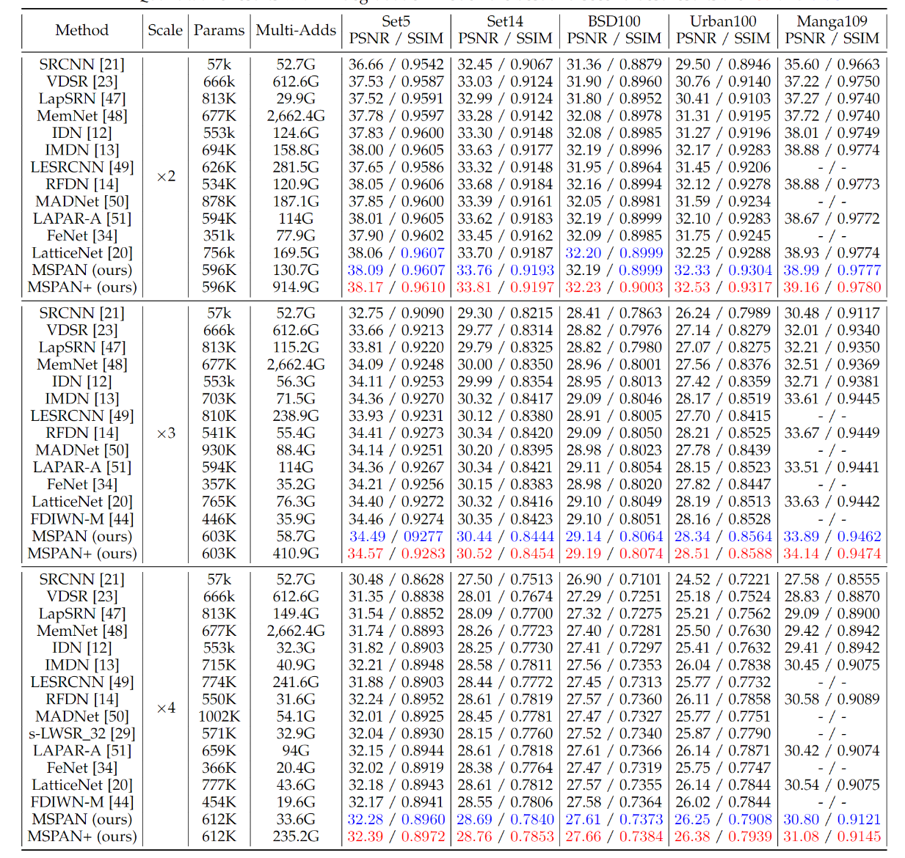 <br />
    <em> Average PSNR/SSIM on datasets Set5, Set14, BSD100, Urban100, and Manga109. </em>
</p>


## Visual comparisons

<p align="center">
    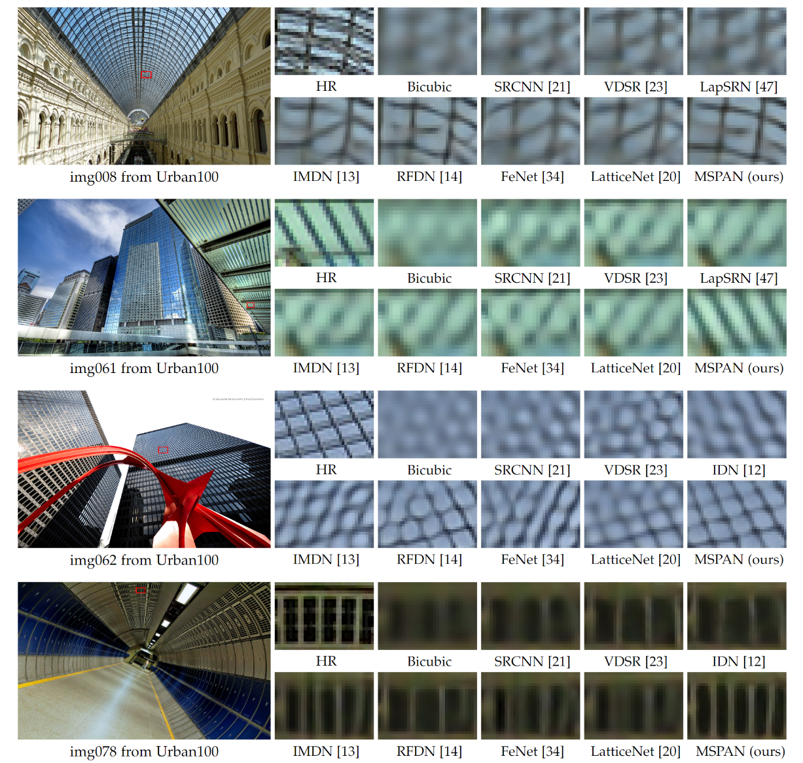 <br />
    <em> Visual comparison for 4× SR with BI degradation on Urban100 dataset. </em>
</p>


<p align="center">
    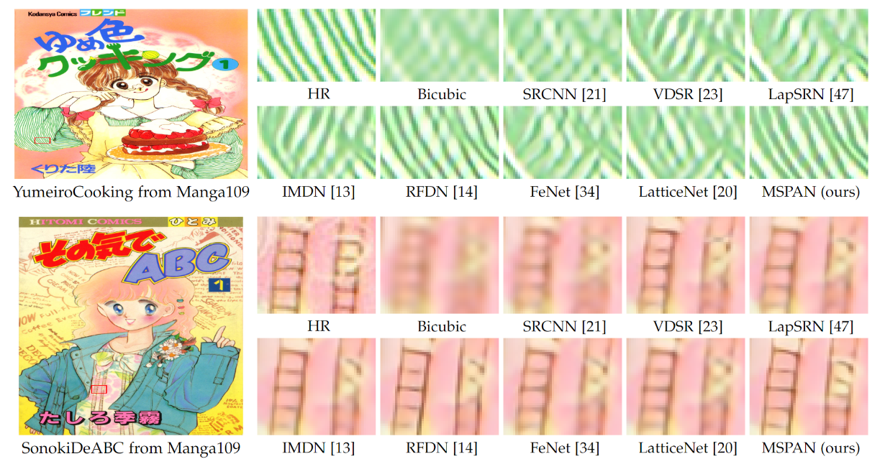 <br />
    <em> Visual comparison for 4× SR with BI degradation on Manga109 dataset. </em>
</p>


<p align="center">
    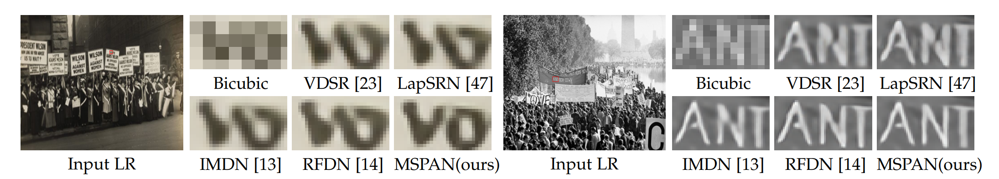 <br />
    <em> Comparison of real-world images. </em>
</p>


<!-- ## Performance
<p align="center">
    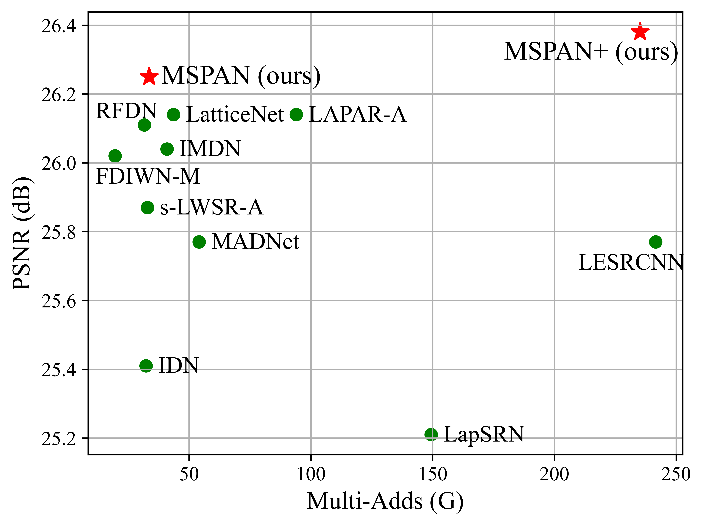 <br />
    <em> Performance versus model parameters. </em>  
</p>
<p align="center">
     <br />
    <em> Performance versus Multi-Adds. </em>    
</p> -->
## Running time

<p align="center">
    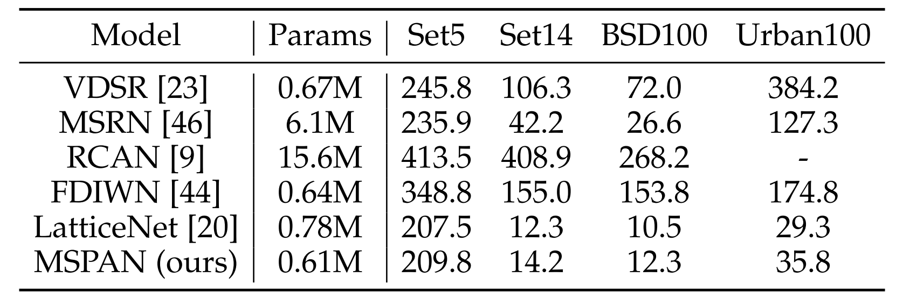 <br />
    <em> Visual comparison of real-world images. </em>
</p>

## Reulsts on Gaussian denoising

<p align="center">
    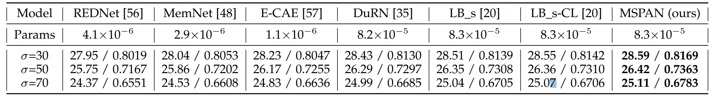 <br />
    <em> Comparison of real-world images. </em>
</p>

## Reulsts on real-world denoising

<p align="center">
    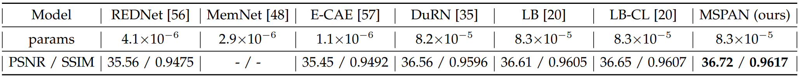 <br />
    <em> Comparison of real-world images. </em>
</p>


## Reulsts on rain-steak removal

<p align="center">
    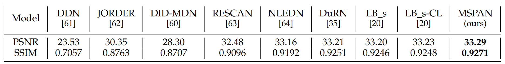 <br />
    <em> Comparison of real-world images. </em>
</p>


<!-- ## Citation

If you find IMDN useful in your research, please consider citing:

```
@inproceedings{Hui-IMDN-2019,
  title={Lightweight Image Super-Resolution with Information Multi-distillation Network},
  author={Hui, Zheng and Gao, Xinbo and Yang, Yunchu and Wang, Xiumei},
  booktitle={Proceedings of the 27th ACM International Conference on Multimedia (ACM MM)},
  pages={2024--2032},
  year={2019}
}

@inproceedings{AIM19constrainedSR,
  title={AIM 2019 Challenge on Constrained Super-Resolution: Methods and Results},
  author={Kai Zhang and Shuhang Gu and Radu Timofte and others},
  booktitle={The IEEE International Conference on Computer Vision (ICCV) Workshops},
  year={2019}
}

``` -->


<!-- # Acknowledgements
This code is built on [IMDN]{} (PyTorch). We thank the authors for sharing their codes of IMDN PyTorch version. -->